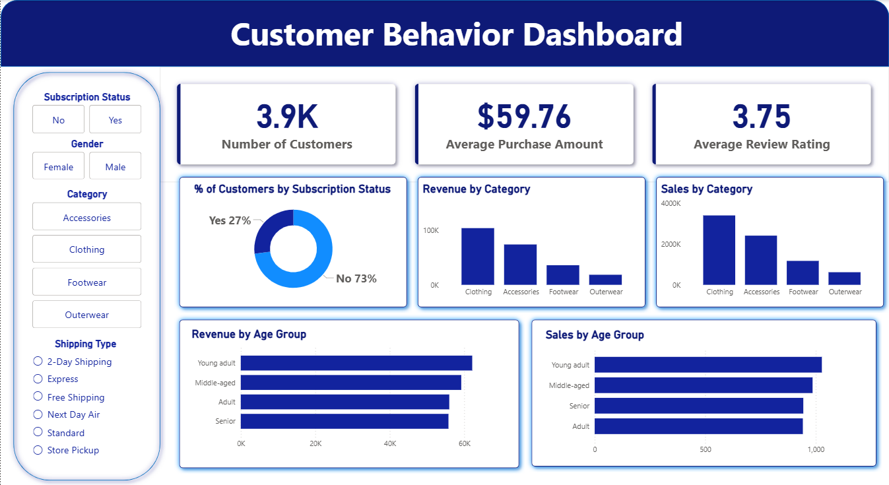

# Customer Behavior Analysis

## Overview
Customer Shopping Behaviour Analysis is a data analytics project that explores a retail shopping dataset to uncover spending patterns, customer segments, and product insights. The work combines Python-based EDA and cleaning, SQL analysis in MySQL, and a Power BI dashboard for reporting.

## Dataset
- Source file: `data/customer_shopping_behavior.csv`
- Coverage: customer demographics, purchase behavior, product categories, reviews, discounts, and shipping types

## Tools
- Python (pandas, Jupyter Notebook)
- MySQL (SQL analysis)
- Power BI (dashboard)

## Steps
1. Load the dataset in Python and perform EDA.
2. Clean and validate data types and missing values.
3. Explore business questions using SQL queries.
4. Build a Power BI dashboard to summarize KPIs and trends.

## Dashboard
- Power BI file: `dashboard/customer_behavior_dashboard.pbix`
- Preview: `dashboard/dashboard.png`

The dashboard highlights core KPIs and breaks down revenue and sales by category and age group, plus subscription and shipping insights.

## Results
- Identifies high-performing categories and customer segments.
- Highlights the impact of subscriptions, discounts, and shipping choices.
- Surfaces product-level insights using review ratings and sales volume.

## Project Structure
```
Customer_Shopping _Behaviour_Analysis/
├─ dashboard/
│  ├─ customer_behavior_dashboard.pbix
│  └─ dashboard.png
├─ data/
│  └─ customer_shopping_behavior.csv
├─ documents/
├─ notebooks/
│  └─ Customer_Shopping _Behaviour_Analysis.ipynb
├─ sql/
│  └─ customer_behavior_analysis.sql
├─ .gitignore
├─ LICENSE
└─ README.md
```

## How to Run
1. Create and activate a Python virtual environment.
2. Install required packages (at minimum: `pandas`, `jupyter`).
3. Open and run the notebook: `notebooks/Customer_Shopping _Behaviour_Analysis.ipynb`.
4. Review SQL queries in `sql/customer_behavior_analysis.sql`.
5. Open the Power BI file in `dashboard/` to view the dashboard.

## Dashboard Preview


## License
MIT License

## Author
Ashika Chamodi
